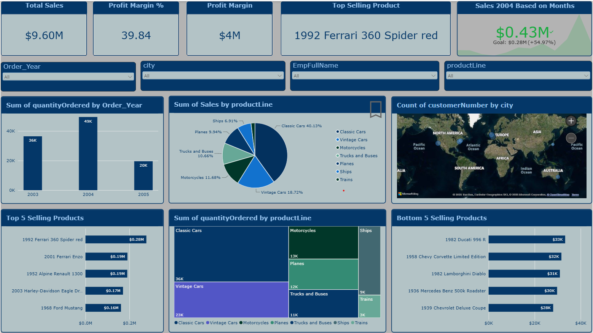
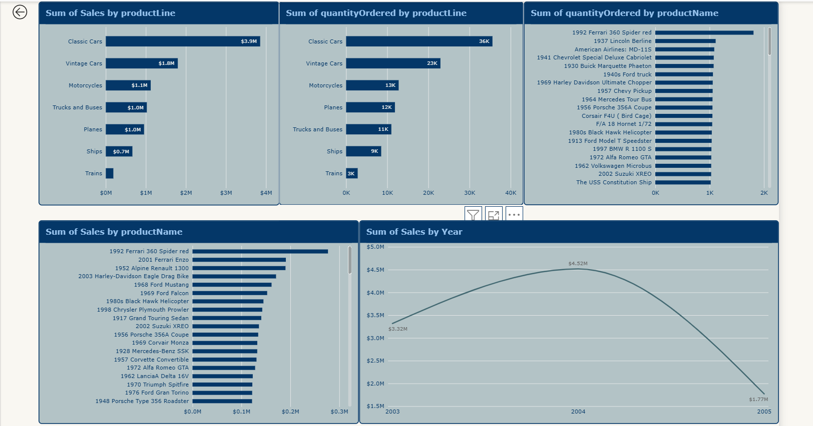
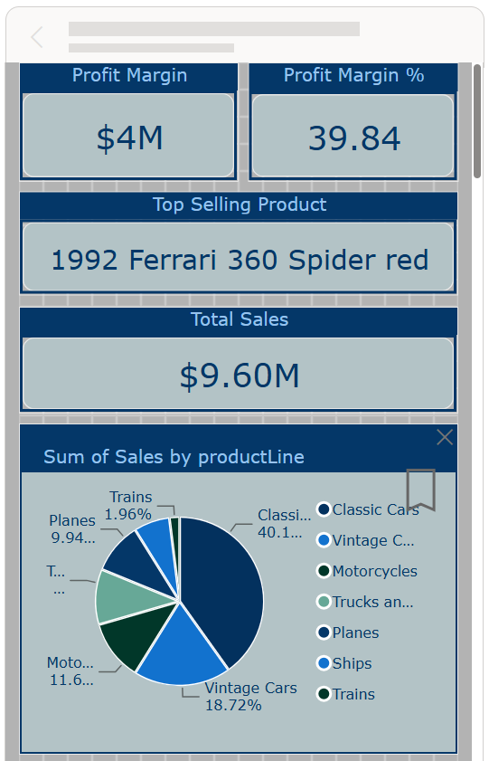
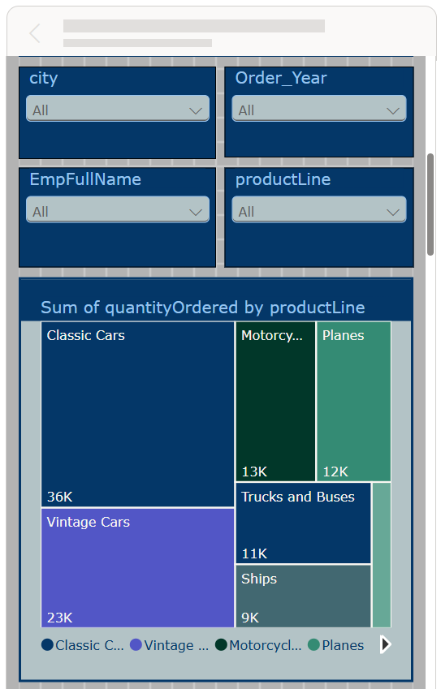
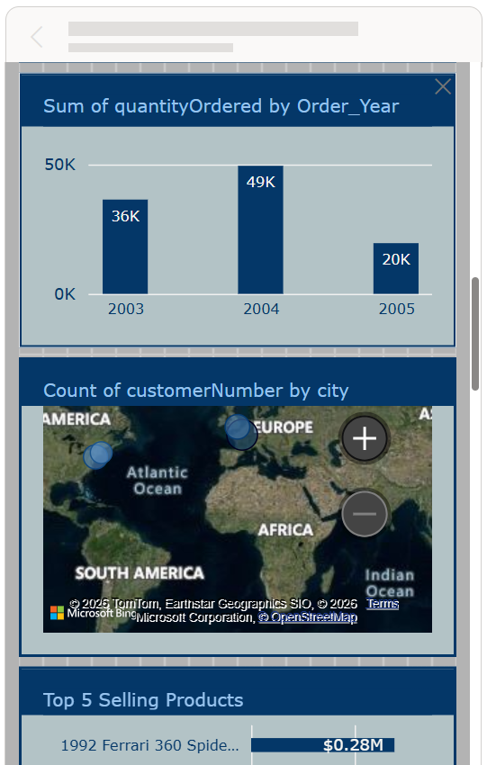
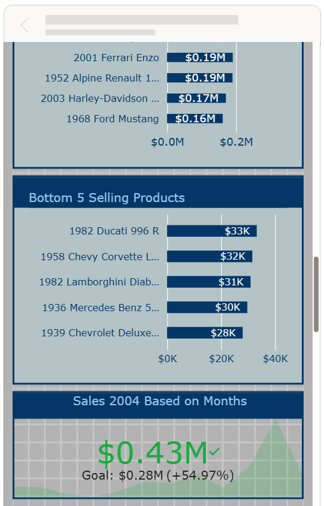

# Classic Models Sales & Business Analytics Dashboard

## Project Overview

This project is an interactive **Sales & Business Analytics Dashboard** created using **Microsoft Power BI**.

The dashboard uses the **Classic Models** dataset to analyze sales performance, product lines, product quantities, individual products, and yearly sales trends.

The goal of this project is to transform business data into meaningful visual insights using Power BI.

## Tools & Technologies

* Microsoft Power BI
* Power Query
* DAX
* Data Modeling
* Data Visualization

## Dashboard Features

The Power BI report includes:

* Sales by Product Line
* Quantity Ordered by Product Line
* Quantity Ordered by Product
* Sales by Product
* Sales by Year
* Top 5 Selling Products
* Interactive visualizations
* Report tooltips
* Data filtering and exploration

## Dashboard Preview

### Main Dashboard

### Sales Analysis

### Mobile Dashboard

The dashboard also includes a mobile-optimized layout for convenient analysis on smaller screens.

## Project Files

| File                                  | Description                                       |
| ------------------------------------- | ------------------------------------------------- |
| `Classic_Models_Sales_Analytics.pbix` | Power BI report containing the complete dashboard |
| `dashboard_overview.png`              | Screenshot of the main dashboard                  |
| `sales_analysis.png`                  | Screenshot of the sales analysis page             |

## Key Analysis

The dashboard provides insights into:

* Which product lines generate the highest sales
* Which product lines have the highest quantity ordered
* Which products have the highest quantities ordered
* Which products contribute significantly to sales
* How sales change across different years

## Project Objective

The objective of this project is to practice and demonstrate skills in:

* Data analysis
* Data visualization
* Power BI dashboard development
* DAX
* Power Query
* Data modeling
* Business intelligence

## How to Use

1. Download the `Classic_Models_Sales_Analytics.pbix` file.
2. Open the file using **Microsoft Power BI Desktop**.
3. Explore the dashboard pages.
4. Use the available visual interactions and filters to analyze the data.

## Project Type

**Data Analytics | Business Intelligence | Power BI**

## Author

Khushi Lakhotia
